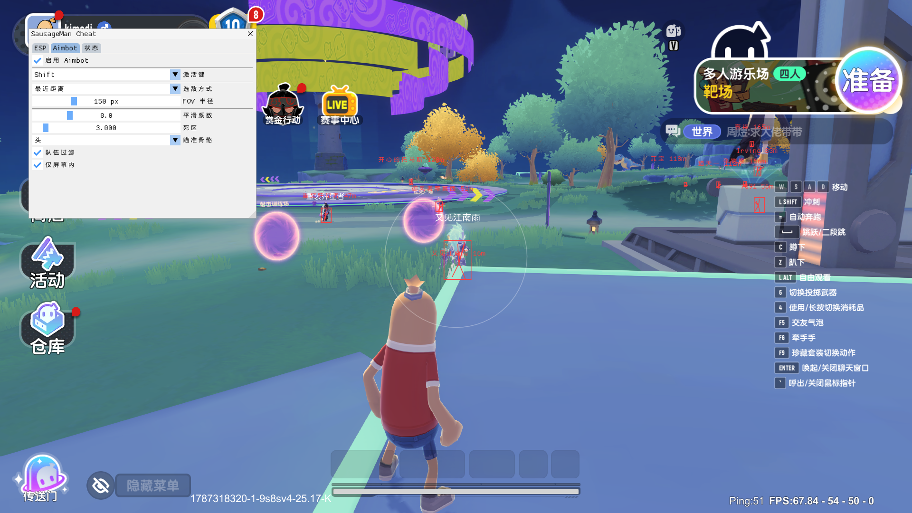

# SausageManCheat

Internal cheat DLL for **Sausage Man** (香肠派对), a Unity IL2CPP PC game.

## Game Info

- **Game:** Sausage Man (香肠派对)
- **Engine:** Unity IL2CPP (no encryption, directly dumpable with IL2CPPDumper)
- **Platform:** PC, installable via [TapTap](https://www.taptap.cn)
- **Dump:** `SausageMan_dump.cs` (80MB) attached to [Release v1.0.0](https://github.com/1ZOverLXRD/SausageManCheat/releases/tag/v1.0.0)

## Features

- **D3D11 Present Hook** — VTable swap, no MinHook
- **ImGui Rendering** — light theme, large fonts, Chinese fallback, Unity Raw Input compatible
- **Player Enumeration** — `GameWorldClientManager → BattleWorld → StartGame → RoleNetList`
- **Skeleton Reading** — `BattleRoleLogic → RLC → BR → RC → AnimatorControl`, 8 bones
- **ESP**
  - 2D Box (auto-sized from bone positions)
  - 3D Box (bone-based dimensions, camera-facing)
  - Skeleton (clean topology, no crossing lines)
  - Health bar
  - Name + distance
  - Team filter / max distance
- **Aimbot** (`mouse_event`)
  - Target selection: nearest / most centered / lowest HP
  - `delta / smooth` — faster when far, converges naturally
  - FOV limit / dead zone / smoothness adjustment
  - Aim at any bone
- **Death Detection** — hand position change: 30 frames (0.5s) still → Suspect, 60 frames (1s) → Inactive
- **W2S** — pure matrix math, zero Unity API calls
- **GameSDK Object Layer** — typed wrappers for Transform, RoleNet, RoleLogic, AnimatorControl



## Project Structure

```
src/
├── dllmain.cpp          # DLL entry point
├── Core/
│   ├── D3D11Hook.cpp/h  # D3D11 Present Hook + ImGui rendering
│   ├── Log.cpp/h        # Logger (console + file)
│   └── Memory.h         # Safe memory read/write (__try/__except guarded)
├── SDK/
│   ├── IL2CPP.cpp/h     # IL2CPP runtime API wrappers
│   ├── GameOffsets.h    # Offset constants (from dump.cs + il2cpp.h)
│   ├── GameObjects.h    # Game object model layer (typed field access)
│   ├── Game.cpp/h       # Game main loop orchestrator
│   ├── CameraManager.cpp/h  # Camera matrix reading + W2S
│   ├── PlayerManager.cpp/h  # Player enumeration + data collection
│   └── MovementTracker.cpp/h # Death detection (hand position based)
└── Cheat/
    ├── Config.cpp/h     # Menu + config persistence
    ├── ESP.cpp/h        # ESP drawing
    └── Aimbot.cpp/h     # mouse_event aimbot
```

## Player Data

### Enumeration Chain

```
GameWorldClientManager (static class)
  └── MyGameWorld (+0x08) → BattleWorld
        └── startGame (+0x498) → StartGame
              └── RoleNetList (+0x98) → List<RoleNet>
```

Read `GameWorldClientManager` via `il2cpp_class_from_name`, traverse `static_fields → MyGameWorld → BattleWorld → StartGame → RoleNetList` to get all players.

### Player Fields

```
RoleNet (+0x00)
  ├── +0x40 → Transform* (managed)     ← player position
  ├── +0x58 → RoleNetClient*
  │     └── +0x1D → bool (isLocalPlayer)
  └── +0x68 → BattleRoleLogic*
        ├── +0x224 → float HP
        ├── +0x228 → float MaxHP
        ├── +0x768 → string* nickname
        ├── +0x770 → int64 playerId
        └── +0x7A8 → int64 team
```

**Position:** `Transform.get_position` (the only Unity API call — 1× per player per frame)

## Skeleton Data

### Access Chain

```
BattleRoleLogic
  └── +0xAE0 → RoleLogicComponent
        └── +0x80 → BattleRole
              └── +0x240 → RoleControl
                    └── +0x48 → AnimatorControl
```

### Bone Offsets

| Offset | Bone | BoneIndex |
|--------|------|-----------|
| +0x80 | LeftHand | 0 |
| +0x88 | RightHand | 1 |
| +0xE8 | Head | 2 |
| +0xF8 | Hip | 3 |
| +0x108 | SkinBody | 4 |
| +0x118 | RightFoot | 5 |
| +0x120 | LeftFoot | 6 |
| +0x190 | Spine | 7 |

### Death Detection

Hand position change (pure math, no API calls):
- Average hand position unchanged for 30 frames (0.5s) → Suspect
- 60 frames (1s) → Inactive
- Movement detected → back to Active

## Camera Matrices

```
GameData (static class)
  └── WarCamera (+0x1E0) → CameraController
        └── MyCamera (+0x30) → managed Camera
              └── m_CachedPtr (+0x10) → native Camera
                    ├── +0x80 → worldToCameraMatrix (16 floats, column-major)
                    └── +0xC0 → projectionMatrix (16 floats, column-major)
```

## Build

Requires VS 2022+ and CMake:

```bash
# 1. Download ImGui to vendor/
scripts/setup_imgui.bat

# 2. Build
cmake -B build
cmake --build build --config Release

# 3. Output
build/bin/Release/SausageManCheat.dll
```

## Injection

Inject `SausageManCheat.dll` into `Sausage Man.exe` with any DLL injector.

- Press `DEL` to toggle menu
- Default aimbot key: `Right Mouse Button`

---

[中文文档 (Chinese)](README-zh.md)